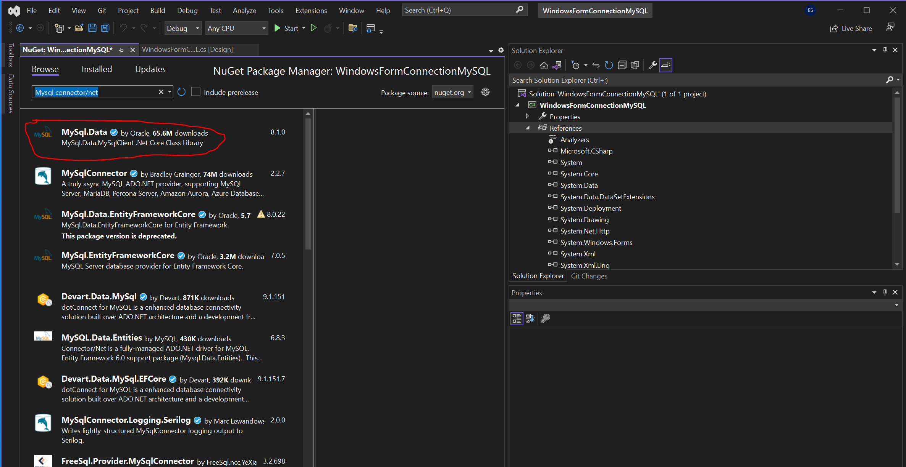

# WindowsFormConnectionMySQL
CSharp - Windows Forms - MySQL

## Features
- Show all data from database table
- Search in table and show

## Techstack
- `C#`
- Windows Forms
- .NET Framework 4.8
- DataGrid
- NuGet: MySql.Data

